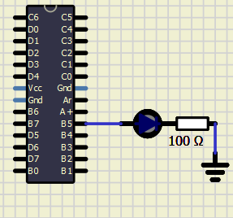
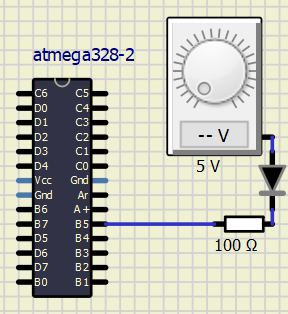
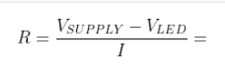
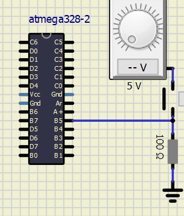
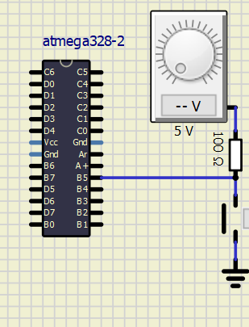

# Lab 2: Control of GPIO, LED, push button

### Learning objectives

The purpose of this laboratory exercise is to learn how to use basic input/output devices such as LEDs (Light Emitting Diodes) and push buttons, and how to control GPIO (General Purpose Input Output) pins with help of control registers.

## Preparation tasks (done before the lab at home)

Draw two basic ways to connect a LED to the output pin of the microcontroller: LED active-low, LED active-high. What is the name of the LED pin that is connected to the microcontroller in each case?

Diode active high:

Diode active low:

[Calculate LED resistor value](https://electronicsclub.info/leds.htm) for typical red and blue LEDs.

| **LED color** | **Supply voltage** | **LED current** | **LED voltage** | **Resistor value** |
| :-: | :-: | :-: | :-: | :-: |
| red | 5&nbsp;V | 20&nbsp;mA | 2 | 150 Ω |
| blue | 5&nbsp;V | 20&nbsp;mA | 4 | 50 Ω|

Draw the basic ways to connect a push button to the microcontroller input pin: button active-low, button active-high.
&nbsp;

Button active high:

Button active low:

