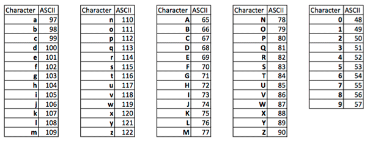

   | **LCD signal(s)** | **AVR pin(s)** | **Description** |
   | :-: | :-: | :-- |
   | RS | PB0 | Register selection signal. Selection between Instruction register (RS=0) and Data register (RS=1) |
   | R/W | GND |  |
   | E | PB1 |  |
   | D[3:0] |  |  |
   | D[7:4] | PD[7:4] |  |
   
   
   | **Function name** | **Function parameters** | **Description** | **Example** |
   | :-- | :-- | :-- | :-- |
   | `lcd_init` | `LCD_DISP_OFF` `LCD_DISP_ON` `LCD_DISP_ON_CURSOR` `LCD_DISP_ON_CURSOR_BLINK` | Display off&nbsp;&nbsp;&nbsp;&nbsp;&nbsp;&nbsp;&nbsp;&nbsp;&nbsp;&nbsp;&nbsp;&nbsp;&nbsp;&nbsp;&nbsp;&nbsp;&nbsp;&nbsp;&nbsp;&nbsp;&nbsp;&nbsp;&nbsp;&nbsp;&nbsp;&nbsp;&nbsp;&nbsp;&nbsp;&nbsp;&nbsp;&nbsp;&nbsp;&nbsp;&nbsp;&nbsp;&nbsp;&nbsp;&nbsp;&nbsp;&nbsp;&nbsp;&nbsp;&nbsp;&nbsp; &nbsp; &nbsp; &nbsp; | `lcd_init(LCD_DISP_OFF);` &nbsp; &nbsp; &nbsp; |
   | `lcd_clrscr` | void|Clear display and set cursor to home position. | `lcd_clrscr();` |
   | `lcd_gotoxy` | uint8_t x   uint8_t y  |Set cursor to specified position. |lcd_gotoxy(3,2) |
   | `lcd_putc` | char 	c| Display character at current cursor position.|lcd_putc('A') |
   | `lcd_puts` | const char * 	s| Display string without auto linefeed.| lcd_puts('Amazing')|
   | `lcd_command` |uint8_t 	cmd |Send LCD controller instruction command. | lcd_command(cmd)|
   | `lcd_data` | uint8_t 	data|Send data byte to LCD controller.Similar to lcd_putc(), but without interpreting LF | lcd_data(data)|
